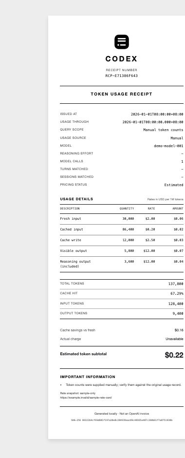
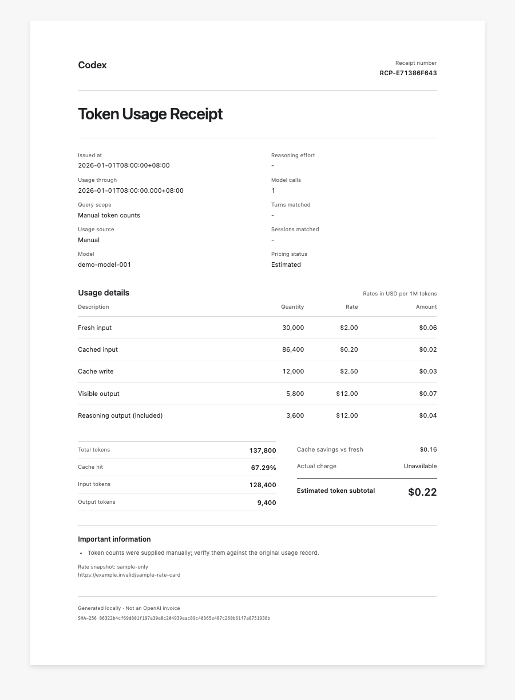

# Generate Token Receipt

[English](README.md) | [简体中文](README.zh-CN.md)

Generate auditable token-usage receipts from local Codex telemetry, OpenAI API usage objects, or exact manual counts. The skill produces a self-contained HTML document and a JSON audit sidecar, with optional PDF and PNG rendering.

Choose between a monochrome 80 mm receipt and a restrained A4 invoice-style layout. Both views use the same normalized audit record, so changing the paper size never changes the token facts, pricing assumptions, receipt ID, or checksum.

> [!IMPORTANT]
> Receipts generated from Codex or ChatGPT subscription telemetry show an **API-equivalent token-cost estimate**. They are not OpenAI bills, subscription charges, tax invoices, or proof of payment.

> [!NOTE]
> This is an independent open-source project, not an OpenAI product and not endorsed by OpenAI. OpenAI and Codex are trademarks of OpenAI; see the [OpenAI brand guidelines](https://openai.com/brand/). The repository uses its own receipt mark, not an OpenAI logo, and the MIT License grants no rights to third-party trademarks.

## Sample layouts

Both previews below come from the same fully synthetic audit record. Every token count, model name, rate, timestamp, receipt number, and checksum is fictional and sample-only; no Codex telemetry or user data is included.

<table>
  <tr>
    <th>80 mm receipt</th>
    <th>A4 invoice-style document</th>
  </tr>
  <tr>
    <td align="center"><a href="docs/images/sample-receipt-80mm.png"></a></td>
    <td align="center"><a href="docs/images/sample-receipt-a4.png"></a></td>
  </tr>
</table>

## Features

- Query the current Codex conversation through a clearly printed cutoff time.
- Combine the previous `N` completed turns or select one exact earlier turn.
- Aggregate locally logged Codex usage for a project folder and its descendants.
- Read Responses API and Chat Completions usage JSON.
- Accept authoritative manual token counts with an exact model ID.
- Separate fresh input, cached input, cache writes, visible output, and reasoning output.
- Price mixed-model usage per call with exact snapshots or a clearly labeled reference-model approximation.
- Generate a self-contained HTML receipt plus a machine-readable JSON audit record.
- Render either an 80 mm receipt or an A4 electronic document from the same record.
- Validate audit records with a SHA-256 checksum before re-rendering.
- Redact raw session and turn identifiers by default.

## Requirements

- Codex, when querying the current conversation or completed turns
- Python 3.9 or later
- Google Chrome or Chromium, only when PDF or PNG rendering is requested

The receipt generator itself uses only the Python standard library. No Python packages are required.

## Installation

Clone the repository into the Codex skills directory:

```bash
git clone https://github.com/Beluga0105/generate-token-receipt.git \
  ~/.codex/skills/generate-token-receipt
```

Restart Codex after installation so the skill can be discovered.

Verify the command-line entry point:

```bash
python3 ~/.codex/skills/generate-token-receipt/scripts/generate_receipt.py --help
```

## Use with Codex

Ask naturally, or invoke the skill by name:

```text
Use $generate-token-receipt to create an 80 mm receipt for this Codex task,
including subagents, and also export PDF and PNG copies.
```

Other example requests:

```text
Create an A4 token receipt for my previous two completed turns.

Generate a receipt for all locally logged Codex usage in this project folder.

Turn this OpenAI Responses API usage JSON into an auditable token receipt.
```

Codex chooses the appropriate source, issues live telemetry receipts at the end of its substantive work, verifies the requested scope, and returns the requested artifacts.

## Command-line examples

Set `SKILL_DIR` to the installed skill directory before running these commands:

```bash
SKILL_DIR="$HOME/.codex/skills/generate-token-receipt"
```

### Current Codex conversation

This mode is intended to run inside the active Codex task because it uses `CODEX_THREAD_ID` supplied by Codex:

```bash
python3 "$SKILL_DIR/scripts/generate_receipt.py" \
  --codex-current \
  --include-subagents \
  --output "/absolute/path/token-receipt.html"
```

### Previous completed turns

Combine the previous two completed turns:

```bash
python3 "$SKILL_DIR/scripts/generate_receipt.py" \
  --codex-last-turns 2 \
  --include-subagents \
  --output "/absolute/path/previous-two-turns.html"
```

Select only the turn two rounds back:

```bash
python3 "$SKILL_DIR/scripts/generate_receipt.py" \
  --codex-turn 2 \
  --output "/absolute/path/turn-two-back.html"
```

Completed-turn scopes exclude the active turn. Descendants are discovered across all locally retained session and archived-session logs. When subagents are included, their usage is attributed by token-event timestamps within the selected root-turn window.

### Project-folder total

```bash
python3 "$SKILL_DIR/scripts/generate_receipt.py" \
  --codex-project "/absolute/path/to/project" \
  --output "/absolute/path/project-token-receipt.html"
```

Project totals cover only matching local logs still present on the device. Remote, deleted, expired, corrupt, or unlogged activity cannot be included.

### OpenAI API usage JSON

```bash
python3 "$SKILL_DIR/scripts/generate_receipt.py" \
  --usage-json "/absolute/path/response.json" \
  --output "/absolute/path/api-token-receipt.html"
```

The parser accepts usage shapes from the Responses API and Chat Completions, including common wrapped response bodies. API request IDs and the supplied filename are redacted by default. Add `--include-source-metadata` only when those values are explicitly needed for local forensic correlation.

### Exact manual counts

```bash
python3 "$SKILL_DIR/scripts/generate_receipt.py" \
  --model "exact-model-id" \
  --input-tokens 125000 \
  --cached-input-tokens 80000 \
  --output-tokens 4200 \
  --reasoning-tokens 1800 \
  --manual-exact \
  --input-rate 5 \
  --cached-input-rate 0.5 \
  --cache-write-input-rate 6.25 \
  --output-rate 30 \
  --pricing-as-of "YYYY-MM-DD" \
  --pricing-source "https://example.com/exact-model-rate-card" \
  --output "/absolute/path/manual-token-receipt.html"
```

Use `--manual-exact` only when the counts were copied from an authoritative usage record. The four explicit rates must be supplied together, along with `--pricing-as-of` and an HTTP(S) `--pricing-source`.

## Paper sizes and re-rendering

The default paper profile is `80mm`. Use `--paper a4` for the A4 layout:

```bash
python3 "$SKILL_DIR/scripts/generate_receipt.py" \
  --usage-json "/absolute/path/response.json" \
  --paper a4 \
  --output "/absolute/path/token-receipt-a4.html"
```

To create another layout without recollecting usage or recalculating pricing, render from the existing JSON sidecar:

```bash
python3 "$SKILL_DIR/scripts/generate_receipt.py" \
  --receipt-json "/absolute/path/token-receipt.json" \
  --paper a4 \
  --output "/absolute/path/token-receipt-a4.html"
```

The checksum is verified before an existing audit record is rendered.

## PDF and PNG output

```bash
python3 "$SKILL_DIR/scripts/render_receipt.py" \
  "/absolute/path/token-receipt.html" \
  --pdf "/absolute/path/token-receipt.pdf" \
  --png "/absolute/path/token-receipt-preview.png"
```

The renderer searches for Chrome or Chromium on macOS, Linux, and Windows. If detection fails, pass an explicit executable path with `--chrome`.

Receipt generation never sends a job to a physical printer.

## Pricing behavior

The skill prices each model call before aggregating the receipt.

- The source includes official [`gpt-5.6-luna`](https://developers.openai.com/api/docs/models/gpt-5.6-luna), [`gpt-5.6-terra`](https://developers.openai.com/api/docs/models/gpt-5.6-terra), and [`gpt-5.6-sol`](https://developers.openai.com/api/docs/models/gpt-5.6-sol) snapshots verified on 2026-08-13.
- Mixed-model category rows show effective blended rates while the JSON retains every exact model rate card.
- A locally queried Codex model without an exact snapshot uses `gpt-5.6-terra` as a visible reference-model approximation instead of returning an unavailable USD subtotal.
- Unknown API-response and manual models still require all four explicit rates: fresh input, cached input, cache-write input, and output.
- The rate-card date and source URL are stored and printed with the receipt.
- Reasoning tokens are shown as a subset of output and are never charged a second time.
- Tool fees, taxes, credits, subscription allocation, and unknown charge dimensions remain excluded.
- Displayed rates, USD amounts, and percentages use two decimal places; the JSON retains full calculation precision.

Always verify current pricing against the exact official model page before supplying an external rate card.

## Privacy and data boundaries

- Prompts, responses, API keys, and project files are never copied into the receipt.
- Raw Codex session and turn UUIDs are redacted by default.
- Project receipts store the folder name and a short path fingerprint, not the absolute project path. The fingerprint is stable and can link receipts generated for the same local path.
- HTML output embeds the repository's original receipt mark as a data URI and loads no remote fonts, scripts, or images.
- `--include-session-ids` is an explicit opt-in for local forensic correlation and may expose sensitive identifiers.
- API request IDs and supplied usage filenames are redacted by default; `--include-source-metadata` is an explicit opt-in.
- Both the HTML and JSON contain the complete normalized audit record, including detailed per-call metadata. Review both before sharing publicly.

Everything is generated locally. The skill does not upload receipts or usage data.

## Output files

By default, the generator creates:

```text
token-receipt.html   Self-contained human-readable receipt
token-receipt.json   Normalized audit record and SHA-256 checksum
```

Optional rendering adds:

```text
token-receipt.pdf
token-receipt-preview.png
```

Keep the HTML and JSON sidecar together when preserving or sharing an auditable receipt.

## Repository structure

```text
generate-token-receipt/
├── .github/
│   └── workflows/
│       └── test.yml
├── .gitignore
├── .gitattributes
├── LICENSE
├── README.md
├── README.zh-CN.md
├── SKILL.md
├── agents/
│   └── openai.yaml
├── assets/
│   └── receipt-mark.svg
├── docs/
│   └── images/
│       ├── sample-receipt-80mm.png
│       └── sample-receipt-a4.png
├── references/
│   └── receipt-contract.md
├── scripts/
│   ├── generate_receipt.py
│   └── render_receipt.py
└── tests/
    └── test_generate_receipt.py
```

`references/receipt-contract.md` defines the normalized record, ingestion mappings, pricing rules, and the boundary for future printer integrations.

## Limitations

- Codex totals are derived from local telemetry, not organization-wide billing records.
- The current-conversation cutoff can exclude the receipt-generation call and the final delivery message.
- Unknown local Codex models use a labeled reference estimate; unknown API or manual models require explicit rates.
- PDF and PNG export requires a local Chrome or Chromium installation.
- This project does not create official invoices or retrieve actual subscription charges.

## Development

Run the dependency-free release tests with:

```bash
python3 -m unittest discover -s tests -v
```

The included GitHub Actions workflow runs the same checks on pushes and pull requests.

## License

Released under the [MIT License](LICENSE).
